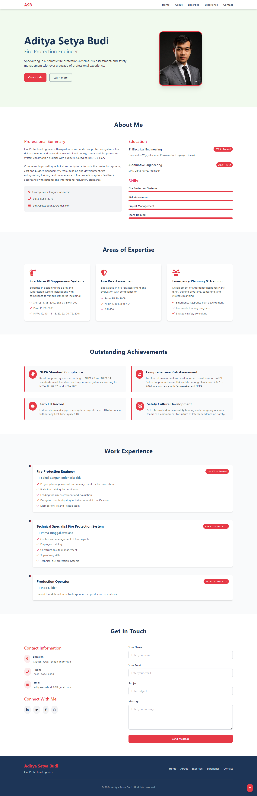

# 💼 Aditya Setya Budi - Professional Portfolio

Ini adalah halaman portfolio pribadi **Aditya Setya Budi** yang dibuat menggunakan **HTML5**, **Tailwind CSS (via CDN)**, dan **Font Awesome**. Situs ini dirancang **responsif**, sederhana, dan mudah untuk dikembangkan oleh siapa saja, bahkan yang baru belajar pengembangan web.

---

## 📌 Fitur Utama

- Tampilan modern dan responsif menggunakan Tailwind CSS
- Navigasi mobile-friendly
- Informasi pribadi, pendidikan, pengalaman kerja, dan keterampilan teknis
- Formulir kontak siap dikembangkan
- Siap dideploy ke GitHub Pages

---

## 🚀 Cara Menjalankan Proyek

1. **Clone repositori ini**
   ```bash
   git clone https://github.com/adityasetyabudi/web-portfolio.git
   ```

2. **Masuk ke folder proyek**
   ```bash
   cd web-portfolio
   ```

3. **Buka file `index.html` di browser**
   - Klik dua kali `index.html`, atau
   - Jalankan di VSCode dan klik tombol "Go Live" (jika menggunakan ekstensi Live Server)

---

## 🛠 Struktur Folder

```
web-portfolio/
├── assets/
│   └── profile.jpeg      # Gambar profil yang digunakan di halaman
├── index.html                # Halaman utama portfolio
└── README.md                 # Dokumentasi proyek
```

---

## 🌐 Link Halaman Live

Website ini sudah di-deploy menggunakan GitHub Pages dan bisa diakses melalui:

🔗 [https://aditya-sb.netlify.app/](https://aditya-sb.netlify.app/)

---

## 📸 Screenshot

Tampilan awal halaman:

> 

---

## 🧑‍💻 Teknologi yang Digunakan

- HTML5
- Tailwind CSS (via CDN)
- Font Awesome (ikon)
- JavaScript dasar (untuk navigasi & menu mobile)

---

## 🤝 Kontribusi

Ingin mengembangkan atau memodifikasi? Silakan!

Jika kamu pemula:
- Mulailah dengan mengedit isi di bagian `<section>` seperti About, Experience, dan Skills
- Ganti foto di folder `assets`
- Simpan dan buka ulang `index.html` di browser

---

## 📩 Kontak

Jika ada pertanyaan atau ingin terhubung:

- 📧 Email: adityasetyabudi.20@gmail.com 
- 📍 Lokasi: Cilacap, Jawa Tengah, Indonesia 

---

> Dibuat dengan semangat belajar dan pengembangan diri oleh Aditya Setya Budi.
> Support by practicum assistant [https://github.com/arifnurrizqi/] (Arif Nur Rizqi)